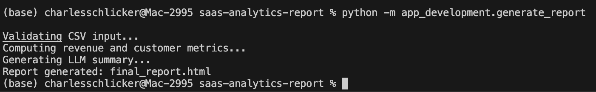
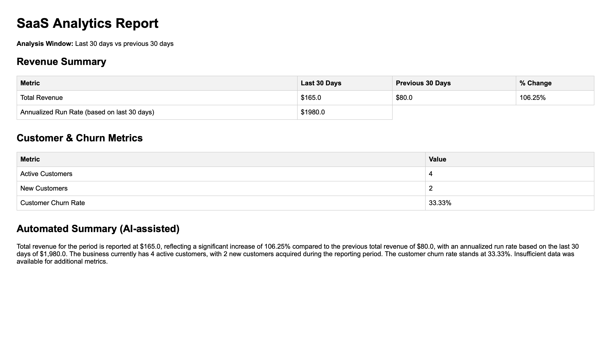

SaaS Revenue & Customer Analytics Report Generator
Overview
Early-stage SaaS founders often have access to raw billing exports (e.g., Stripe CSVs) but lack a fast, reliable way to extract meaningful monthly insights. This project provides a lightweight analytics pipeline that validates uploaded billing data, computes key revenue and customer metrics, and generates a concise, downloadable executive report.
The application is designed to be deterministic, transparent, and cautious — prioritizing correctness and interpretability over forecasting or speculative analysis.

What This App Does
1. Accepts a CSV export of billing data
2. Validates data structure and date coverage
3. Computes key monthly metrics
4. Generates a structured HTML report
5. Produces a short LLM-assisted executive summary when sufficient data is available
6. The output is a single, shareable report suitable for internal review or stakeholder discussions.

Target Users
- Early-stage SaaS founders
- Non-technical startup operators
- Consultants reviewing short-term revenue and customer dynamics
- This is not an investor dashboard or forecasting tool.

Metrics Computed
Revenue Metrics (Last 30 Days)
- Total revenue
- Revenue change vs previous 30-day period
- Annualized run rate (based strictly on last 30 days)
Customer Metrics
- Active customers
- New customers
- Customer churn rate
Metrics gracefully degrade:
- If insufficient historical data is available, affected metrics are marked N/A
- Reports still generate with partial insights when possible

Executive Summary (LLM-Assisted)
When all required metrics are available, the app generates a 3–4 sentence executive summary using an LLM.
The summary:
- Is based only on computed metrics
- Avoids speculation, forecasting, or advice
- Explicitly acknowledges missing data when applicable
- Uses a concise, consulting-style tone
LLM usage is strictly controlled and cost-bounded.

Example Outputs
## Running the report generator

The report is generated by running the analytics pipeline as a Python module:

### Generated analytics report

The tool produces a structured HTML report with computed SaaS metrics and an AI-assisted executive summary:

- Full metrics report (complete data, above)
- Report with soft warnings (partial data)
- Fallback report (validation failure)

Design Principles
- Deterministic analytics — no hidden assumptions
- Clear scope boundaries — no predictive modeling
- Graceful failure modes — users always receive a report
- Minimal surface area — one upload, one output

Limitations
- No forecasting or ARR projections beyond simple annualization
- No customer-level identity exposure
- No authentication or user accounts
- Intended for monthly diagnostics, not long-term trend analysis

How to Run Locally
pip install -r requirements.txt
python -m app_development.generate_report

Upload a CSV containing:
- customer_id
- charge_date
- amount (in cents)

Deployment
The application is deployed as a lightweight backend service (Render free tier) with a minimal upload interface. It is intentionally semi-public and designed for demonstration and portfolio use.

Monetization Considerations
This application incurs per-request LLM inference costs. In a production setting,
usage would be gated behind authentication and a per-report fee or subscription
model. Payments were intentionally not implemented in this version to keep the
focus on data ingestion, validation, and analytics pipeline design.

Why This Project?
This project demonstrates:
- Data validation and time-windowed analytics
- Thoughtful metric design with edge-case handling
- Safe and constrained LLM integration
- End-to-end report generation
- Deployment discipline without premature complexity
