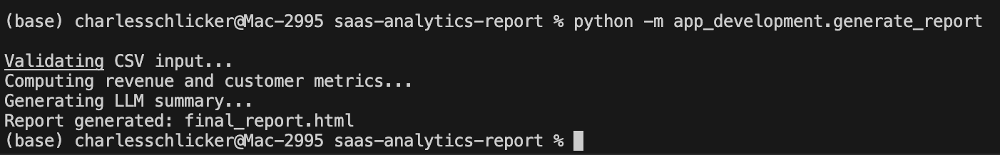
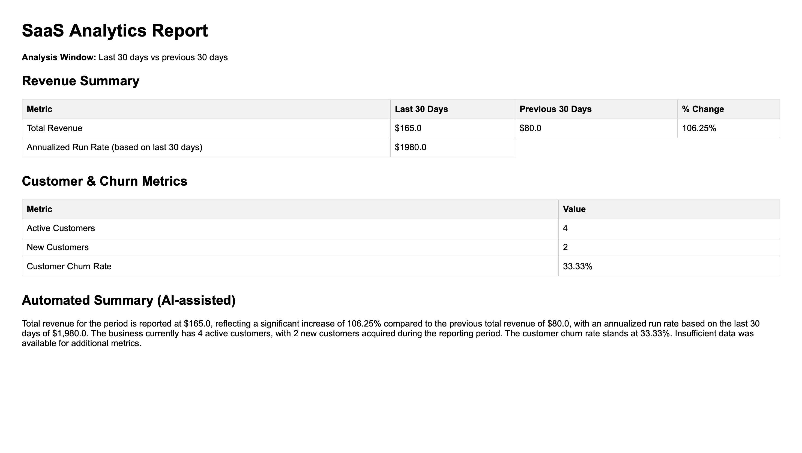

# SaaS Revenue & Customer Analytics Report Generator

A lightweight analytics pipeline for early-stage SaaS founders. Upload a billing CSV export, and the tool validates the data, computes key revenue and customer metrics, and generates a concise, downloadable executive report — with an optional LLM-assisted summary when sufficient data is available.

The application is designed to be deterministic, transparent, and conservative: it prioritizes correctness and interpretability over forecasting or speculative analysis.

**Live demo:** [https://saas-analytics-report-generator.onrender.com/docs](https://saas-analytics-report-generator.onrender.com/docs)

---

## What It Does

1. Accepts a CSV export of billing data
2. Validates data structure and date coverage
3. Computes key monthly revenue and customer metrics
4. Generates a structured HTML report
5. Produces a short LLM-assisted executive summary when sufficient data is available

The output is a single, shareable report suitable for internal review or stakeholder discussions.

---

## Target Users

- Early-stage SaaS founders
- Non-technical startup operators
- Consultants reviewing short-term revenue and customer dynamics

This is not an investor dashboard or forecasting tool.

---

## Metrics Computed

### Revenue (Last 30 Days)
- Total revenue
- Revenue change vs. previous 30-day period
- Annualized run rate (based strictly on last 30 days)

### Customers
- Active customers
- New customers
- Customer churn rate

Metrics degrade gracefully: if insufficient historical data is available, affected metrics are marked N/A and the report still generates with partial insights.

---

## LLM-Assisted Executive Summary

When all required metrics are available, the app generates a 3–4 sentence executive summary:

- Based only on computed metrics — no invented figures
- Avoids speculation, forecasting, or advice
- Explicitly acknowledges missing data when applicable
- Uses a concise, consulting-style tone

LLM usage is strictly controlled and cost-bounded.

---

## Example Outputs

### Terminal execution



### Generated analytics report



The tool handles three states:
- **Full metrics report** — complete data available
- **Soft warnings report** — partial data, metrics marked N/A where applicable
- **Fallback report** — validation failure, with a clear explanation

---

## Design Principles

| Principle | Description |
|---|---|
| Deterministic analytics | No hidden assumptions; same input always produces the same output |
| Clear scope | No predictive modeling or ARR projections beyond simple annualization |
| Graceful failure | Users always receive a report, even on validation failure |
| Minimal surface area | One upload, one output |

---

## Limitations

- No forecasting or multi-period trend analysis
- No customer-level identity exposure
- No authentication or user accounts
- Intended for monthly diagnostics, not long-term tracking

---

## Running Locally

**Install dependencies:**
```bash
pip install -r requirements.txt
```

**Generate a report:**
```bash
python -m app_development.generate_report
```

**Expected CSV columns:**

| Column | Description |
|---|---|
| `customer_id` | Unique customer identifier |
| `charge_date` | Date of the billing event |
| `amount` | Charge amount in cents |

---

## Deployment

The application is deployed on Render's free tier as a lightweight backend service with a minimal upload interface. It is intentionally semi-public and designed for demonstration and portfolio use.

---

## Monetization Considerations

This application incurs per-request LLM inference costs. In a production setting, usage would be gated behind authentication with a per-report fee or subscription model. Payments were intentionally excluded from this version to keep the focus on data ingestion, validation, and analytics pipeline design.

---

## Why This Project?

This project demonstrates:

- Data validation and time-windowed analytics
- Thoughtful metric design with explicit edge-case handling
- Safe and cost-bounded LLM integration
- End-to-end report generation
- Deployment discipline without premature complexity
